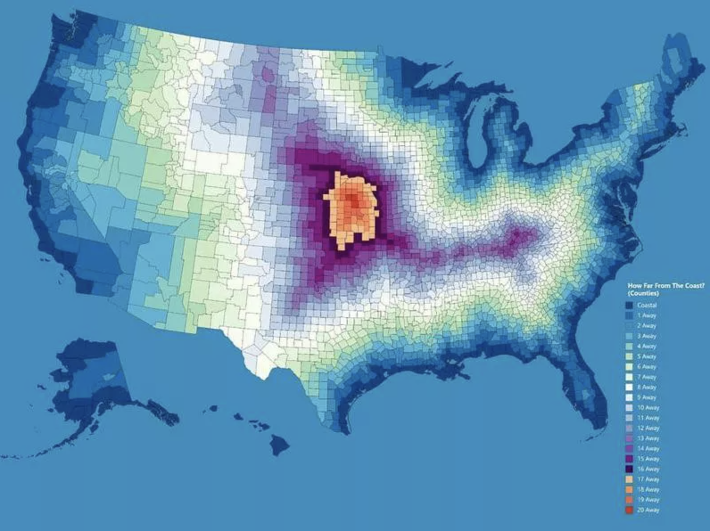
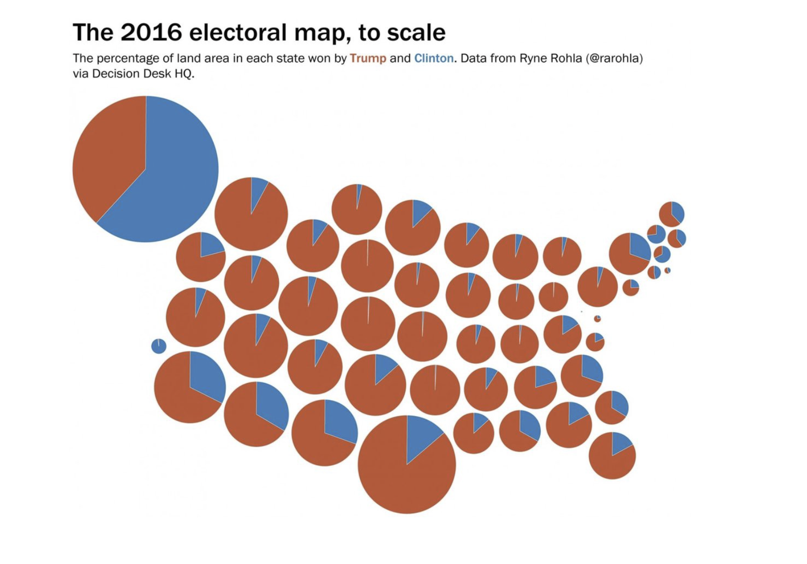

```{r setup, include=FALSE}
knitr::opts_chunk$set(echo = TRUE)
```


## Your assignment

The goals for this assignment are to:

- practice making maps with the various packages
- think about composition and the grammar of graphics
- critique various maps

_By the end of the assignment_ you should have several static maps displaying the datasets we've used in the last few weeks.

# Task 1: Show me your ugly maps!!
Find 2 examples of maps that you think are 'bad'. 



_Question 1_ Why are they bad? What might improve them? 
On the most basic level, these maps are bad because they don't really mean anything. I struggle to think of any scenario, ever, in which you would need to know how many counties away from the coast a particular county is, when "county" is a totally meaningless and wide-ranging unit of distance. The second map is slightly more interesting, but it's equally unclear exactly why or when it would matter. I suppose it's one way of showing that, for many states, less populated areas might be more red? It's also pretty useless in that the lack of state labels make it hard to even know what you're looking at. I generally know where all the states are, but with this organization I'd be hard-pressed to differentiate between, say, Indiana and Iowa in any functional or accessible way. 

_Question 2_ Rely on the Healy and Wilke texts to provide some structure to your answers.
To expand on the above, it would appear that both of these maps got the science/data right (albeit for fairly uninteresting questions, in my opinion), but got the art really wrong. The color choice for the first map (counties) also doesn't have a consistent distance-related gradient, meaning it would look bad as a black-and-white image and likely would not work well for a color-blind person. 


# Task 2: Load your libraries and build a dataframe
You can choose whichever datasets you'd like from the past several months as the subject for your mapping. You'll need to use at least one tabular join, one spatial join, and one extraction to create the dataframe. Load the packages, the data, and make sure everything is projected here. Give me a sense for what you are hoping to map.
```{r libraries}
library(ggplot2)
library(tidyverse)
library(pander)
library(dplyr)
library(sf)
library(units)
library(terra)
# install.packages("cartogram")
library(cartogram)
# install.packages("ggmap")
library(ggmap)
library(tmap)
# install.packages("patchwork")
library(patchwork)
library(viridis)
```

```{r load_data}
# regional land values
landval <- terra::rast('/opt/data/session16/Regval.tif')

# mammal richness
mammal.rich <- rast('/opt/data/session16/Mammals_total_richness.tif')
mammal.rich <- catalyze(mammal.rich) # get value layer
mammal.rich <- mammal.rich[[2]]

# PADUS designation lands
pas.desig <- st_read("/opt/data/session04/regionalPAs1.shp")

# PADUS proclamation lands
pas.proc <- st_read("/opt/data/session16/reg_pas.shp")

# get the column names sorted out
colnames(pas.proc)[c(1, 6, 8, 10, 12, 22, 25)] <- colnames(pas.desig) 
gap.sts <- c("1", "2", "3") # good with Gap statuses 1-3
pas <- pas.proc %>% 
  select(., colnames(pas.desig)) %>% 
  bind_rows(pas.desig, pas.proc) %>%  #select the columns that match and then combine
  filter(., State_Nm =="UT" & GAP_Sts %in% gap.sts ) %>% # filter for Utah and gap status
  st_make_valid() %>% 
  st_buffer(., 10000) # add a 10km buffer
# double check that it's all valid
all(st_is_valid(pas))
```

Build out the dataframe
```{r crs_crop}
# get regional boundary area
utah <- tigris::states(cb=TRUE) %>% 
  filter(STUSPS == "UT") 

# make vector data into SpatVectors
pa.vect <- as(pas, "SpatVector")
ut.vect <- as(utah, "SpatVector")
# get everything into the same projection as mammal richness data
pa.vect <- project(pa.vect, mammal.rich) # buffered protected areas
ut.vect <- project(ut.vect, mammal.rich)
land.val.proj <- project(landval, mammal.rich)

# crop raster to the size of the utah vector
mam.rich.crop <- crop(mammal.rich, ut.vect)
ut.val.crop <- crop(land.val.proj, ut.vect)
crs(mam.rich.crop) == crs(ut.val.crop) # true

# check it out
plot(mam.rich.crop)
plot(ut.vect, add=TRUE)
plot(pa.vect, add=TRUE)
```
```{r census}
# get census data involved
ut.census <- tidycensus:: get_acs(geography = "county", 
              variables = c(medianincome = "B19013_001",
                            pop = "B01003_001"),
              state = c("UT"), 
              year = 2019,
              key = "19c3ab9bcdc3ec1c81d11d51d790be308678a8d2",
              geometry = TRUE) %>% 
              st_transform(., crs(pa.vect)) %>% # get it in the right crs
              select(-moe) %>% # get rid of moe variable
              spread(variable, estimate)
```
```{r extract_join}
# extract and join everything
pa.summary <- st_join(st_as_sf(pa.vect), ut.census, join = st_overlaps) # find overlapping areas

pa.summary <- pa.summary %>% 
  group_by(Unit_Nm) %>% 
  summarize(., meaninc = mean(medianincome, na.rm=TRUE),
            meanpop = mean(pop, na.rm=TRUE))
# check row numbers
nrow(pa.summary) ==length(unique(pas$Unit_Nm))

# run zonal statistics
pa.zones <- terra::rasterize(pa.vect, mam.rich.crop, field = "Unit_Nm")
mammal.zones <- terra::zonal(mam.rich.crop, pa.zones, fun = "mean", na.rm=TRUE)
landval.zones <- terra::zonal(ut.val.crop, pa.zones, fun = "mean", na.rm=TRUE)
#Note that there is one few zone than we have in our PA dataset. This is because we have an overlapping jurisdiction; we'll ignore that now but it's a common problem with using the PADUS

summary.df <- pa.summary %>% 
  left_join(., mammal.zones) %>% 
  left_join(., landval.zones)
head(summary.df)
```


# Task 3: Build a map with Tmap
Practice making a quick map with tmap. 
```{r tmap}
# kind of dumpy version
tm_shape(summary.df) + tm_polygons(col = "meanpop",  border.col = "white") + 
  tm_legend(outside = TRUE)

# more detailed map
tm_shape(mam.rich.crop) +
  tm_raster("Value", palette = viridis(n=50), n=50, legend.show=FALSE, legend.hist = TRUE, legend.hist.title = "Species Richness") +
tm_shape(utah) +
  tm_borders("white", lwd = .75) +
tm_shape(summary.df) +
  tm_polygons(col = "meanpop",  border.col = "white", title="Mean Population") + 
  tm_legend(outside = TRUE)
```

# Task 4: Build a choropleth with ggplot
Your map should have a basemap, should rely on more than one aesthetic (color, transparency, etc), and combine multiple layers.
```{r chloropleth}
# simple ggplot mapping polygons by mean income
ggplot(summary.df) +
  geom_sf(mapping = aes(fill = meaninc))

# more complex ggplot with ggmap basemap
bg <- ggmap::get_map(as.vector(st_bbox(utah))) # get basemap for correct bounding box/location
ggmap(bg) +
   geom_sf(data = summary.df, mapping = aes(fill = meaninc), inherit.aes = FALSE) +
  geom_sf(data=utah, fill=NA,color="black", inherit.aes = FALSE) +
  coord_sf(crs = st_crs(4326))

# one more time with a scale
ggmap(bg) +
  geom_sf(data = summary.df, mapping = aes(fill = Value, 
                                           alpha = (Regval - max(Regval, na.rm=TRUE))/(max(Regval, na.rm=TRUE)-min(Regval, na.rm = TRUE))), inherit.aes = FALSE) +
  geom_sf(data=utah, fill=NA,color="black", inherit.aes = FALSE) +
  scale_fill_viridis(option="magma")+
  labs(title="Species Richness and Land Value in Utah Protected Areas", x="Longitude", y="Latitude", fill="Species Richness", alpha="Land Cost Factor") +
  coord_sf(crs = st_crs(4326))
```


# Task 5: Build 2 cartograms
Follow the examples to build cartograms that display your region of interest based on variables other than area.
```{r population}
ut_pop <- cartogram_cont(ut.census, "pop", itermax = 5)
tm_shape(ut_pop) + tm_polygons("pop", style = "jenks") +
  tm_layout(frame = FALSE, legend.position = c("left", "bottom")) 

# get counties
ut.counties <- tigris::counties(state="UT",cb=TRUE)
# try a different population visualization with non-contiguous area
ut_pop_ncont <- cartogram_ncont(ut.census, "pop")
tm_shape(ut.counties) + tm_borders() +
  tm_shape(ut_pop_ncont) +
  tm_polygons("pop", style = "jenks") +
  tm_layout(frame = FALSE, legend.outside=TRUE) 
```

```{r income}
ut_inc <- cartogram_cont(ut.census, "medianincome", itermax = 5)
tm_shape(ut_inc) + tm_polygons("pop", style = "jenks") +
  tm_layout(frame = FALSE, legend.position = c("left", "bottom")) 
```

_Question 3:_ Reflect on the different maps you've made, what do the different visualizations tell you about the data you plotted?

_Question 4:_ How might you improve the maps you've made?

_Question 5:_ Is a map the best way to evaluate the data you worked with? Why or Why not?


